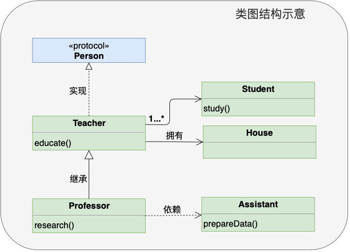
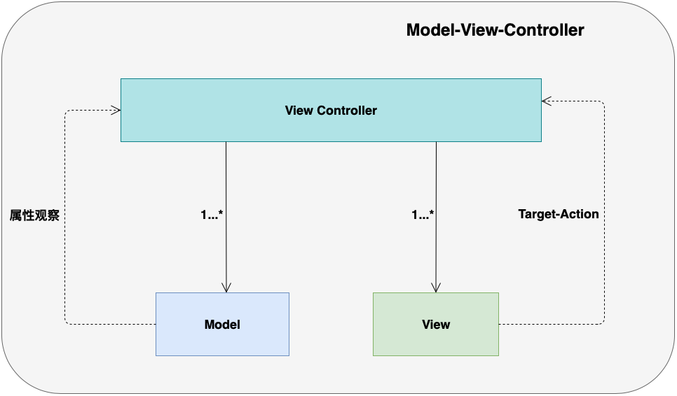
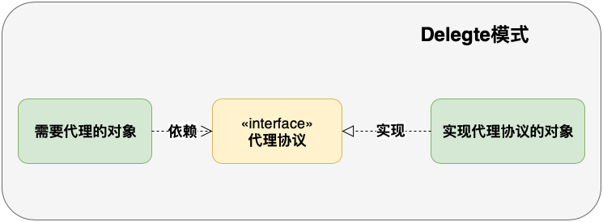
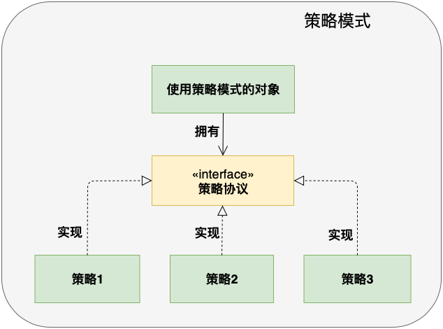
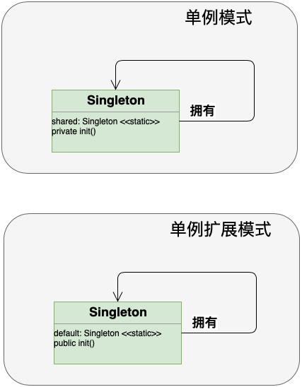
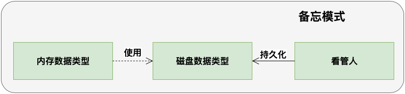

# OrzSwiftDP

新手畏惧设计模式，但是架构师很钟爱它。正确使用设计模式，可以节约开发时间，提高程序质量，成为更优秀的开发者。

设计模式和具体语言无太大关系，是一种设计思想。我们应该去了解并掌握它。

设计模式是可以套用的一些常见问题的通用解决方案。它们都经过几十年许多项目的验证，但设计模式是抽象的概念，并不具体。只有在应用的时候，才能变的具体。

设计模式大体可以分成三种类型: 

- 结构类设计模式：描述对象如何通过组合形成更大更复杂的结构，例如: MVC、MVVM、Facade
- 行为类设计模式：描述对象之间如何相互交互，例如: 代理模式、策略模式和观察者模式
- 创建类设计模式：描述怎样创建对象，例如：构建者模式、单例模式、原型模式

并不是学习了设计模式就能写好代码，设计模式要在合适的场景下正确的使用才能发挥出大作用。过度使用设计模式会让项目变的很复杂。

## 如何读懂类图

UML是创建类图的标准语言，但开发中并不需要完全了解UML，只需要了解UML的一部分就可以用它来画类图描述设计模式了。

类图包括：类、协议、属性、方法和关系(继承、实现、拥有、依赖) ，依赖和拥有这两种关系都可以通过成员变量持有来体现，不同的是，依赖对应的是弱引用，拥有对应的是强引用。

如上图示意图，类图描述的含义如下：

- 定义一个`Person`协议
- `Teacher`类实现了`Person`协议，`Teacher`类有`educate()`方法
- `Teacher`类拥有一个`House`，有一个或多个`Student`，`Student`类有`study()`方法
- `Professor`类继承`Teacher`类，有`research()`方法
- `Professor`类依赖`Assistant`类提供研究数据， `Assistant`类有`prepareData()`方法

## Orz Swift 设计模式

1. 

2. 
    - 代理的个数不应该太多，代理模式不应该滥用，如果发现代理个数太多，考虑拆分逻辑
    - 代理模式采用弱引用，如果需要创建强引用代理，可以考虑使用策略模式
    
3. 
    - 与Delegate模式类似，都使用协议来增加灵活性
    - 策略模式可以在运行时动态替换，但代理模式的代理通常是固定的
    
4. 
    - 限定一个类有且仅有一个实例对象，例如`UIApplication`
    - 单例扩展模式适用于通常情况下，只需要一个默认实例对象，在需要的时候还可以创建新的实例对象，例如`FileManager`
    
5. 
    - 看管人负责把内存数据类型转换成磁盘数据类型并持久化起来，完成数据存储
    - 然后看管人负责把存储的数据取出来转换成磁盘数据类型，并最终转换恢复成为内存数据，完成数据的读取

- 组播代理模式(MulticastDelegate)
